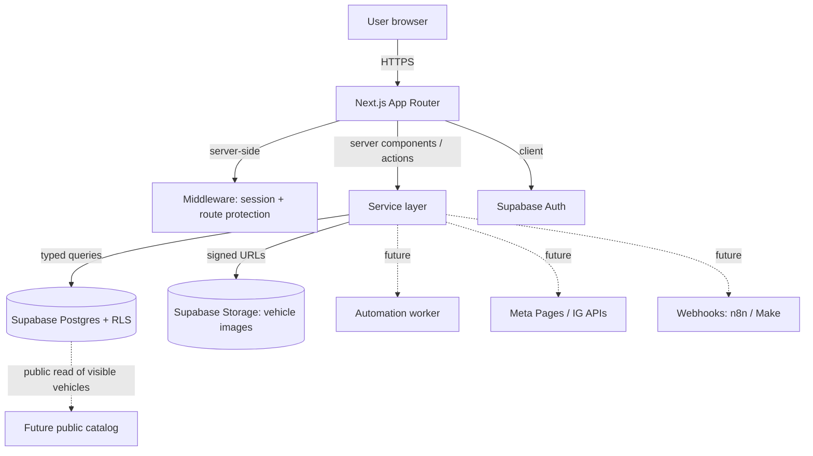

# Architecture

DWS PublishFlow is a **modular monolith**: a single Next.js application backed by
Supabase. The team is small and the domain boundaries are still settling, so a
monolith with clean internal modules gives the fastest iteration while keeping
the option to extract services (notably the automation worker) later.

## Goals and constraints

- Internal business tool first, **SaaS-ready** architecture second.
- Every business entity is **scoped to a company** from day one, even though only
  Hernández Car Import exists at launch.
- Clear separation of concerns: UI, auth, services, database access, theme, and
  automation never bleed into each other.
- No risky browser automation in the core. Facebook Groups use an **assisted**
  workflow; official APIs are preferred where they exist.
- Centralized, theme-ready design system so future companies can rebrand without
  a UI rewrite.

## High-level system



Dashed edges are **future** integrations that are architecturally prepared but
not implemented in the first version.

## Layered architecture

The codebase is organized in layers. Dependencies point **downward only** —
UI depends on services, services depend on the database/types, and nothing in a
lower layer imports from a higher one.

```
Presentation   app/ routes, components/, features/ UI
      |
Application     features/* logic, server actions, validation
      |
Domain/Services services/* (auth, companies, vehicles, groups, publications, logs)
      |
Data            db/ (Supabase client, generated types, migrations)
      |
External        automation/ (ports & adapters), integrations/ (meta, webhooks)
```

The **automation** and **integrations** layers are deliberately isolated behind
interfaces (ports & adapters). The rest of the app talks to a
`PublicationStrategy` abstraction and never imports Playwright or a Meta SDK
directly. See [automation-strategy.md](automation-strategy.md).

## Folder structure

This is the target structure for the implementation phases. It will be created
incrementally, not all at once.

```
src/
  app/                      # Next.js App Router routes
    login/
    signup/
    forgot-password/
    dashboard/
    vehicles/
    groups/
    publications/
    history/
    settings/
  components/
    ui/                     # Presentational, reusable, theme-driven
    layout/                 # Shell, nav, headers
    auth/                   # Auth-specific UI pieces
  features/                 # Feature modules (UI + local logic)
    auth/
    dashboard/
    vehicles/
    groups/
    publications/
    history/
    settings/
  services/                 # Business logic, server-side, typed
    auth/
    companies/
    users/
    vehicles/
    groups/
    publications/
    logs/
  db/
    supabase/               # Client factories (browser, server, admin)
    migrations/             # SQL migrations
    types/                  # Generated DB types
  lib/
    validation/             # Zod schemas
    formatting/             # Display formatting helpers
    constants/
    errors/                 # Structured error types and handling
    auth/                   # Auth helpers (guards, role checks)
    theme/                  # Theme tokens and resolver
  automation/               # Fully isolated from UI
    strategies/             # PublicationStrategy implementations
    playwright/             # Future internal RPA (not wired to core yet)
    types/
    logs/
  integrations/
    meta/                   # Future Meta Pages / Instagram APIs
    webhooks/               # Future n8n / Make
  types/                    # Shared cross-cutting types
docs/                       # This documentation
```

If a future refactor produces a cleaner structure, prefer the cleaner structure
over this template — it is a starting point, not a contract.

## Supabase client strategy

Three distinct clients, never mixed:

| Client | Where it runs | Key used | Purpose |
|--------|---------------|----------|---------|
| Browser client | Client components | Anon (public) key | User-scoped reads/writes under RLS |
| Server client | Server components, route handlers, actions | Anon key + user session (cookies) | RLS-enforced server-side data access |
| Admin client | Server-only, narrow use | **Service role key** | Privileged operations (e.g. invites, RLS-bypassing maintenance) |

The **service role key never reaches the browser**. The admin client lives in a
server-only module and is used sparingly. See
[security-and-rls.md](security-and-rls.md).

## Request and data flow

1. A request hits Next.js middleware, which refreshes/validates the Supabase
   session and guards protected routes (`/dashboard` and below).
2. Server components/actions call the **service layer**, never Supabase directly
   from UI components.
3. Services run typed queries through the **server Supabase client**, so
   Row Level Security enforces company isolation at the database level.
4. Images are served via **signed URLs** from Supabase Storage.
5. Mutations write through services, which also append **publication logs** where
   relevant.

## SaaS-readiness boundaries (prepared, not built)

- **Multi-company:** every business table carries `company_id`; RLS keys off the
  caller's company. Adding a second company requires no schema change.
- **Theming per company:** branding lives in the `companies` row and is resolved
  into CSS variables at runtime. See [theme-and-branding.md](theme-and-branding.md).
- **Roles:** `owner` / `admin` / `staff` exist in the data model; enforcement
  starts minimal and expands. See [authentication.md](authentication.md).
- **Public catalog:** vehicle `visibility` (`internal_only` / `visible_in_catalog`
  / `archived`) is modeled now so a separate public catalog can read only
  approved vehicles later. See [catalog-integration.md](catalog-integration.md).

Explicitly **out of scope** for the first version: billing, subscriptions, public
SaaS onboarding, and full multi-tenant administration.

## Quality gates

Before each phase is considered done, run the available scripts and check the
items in [code-standards.md](code-standards.md):

- `npm run lint`
- `npm run typecheck`
- `npm run build`
- `npm run test` (when present)

If a script does not yet exist, it is documented as a gap and proposed for the
phase that introduces it.
