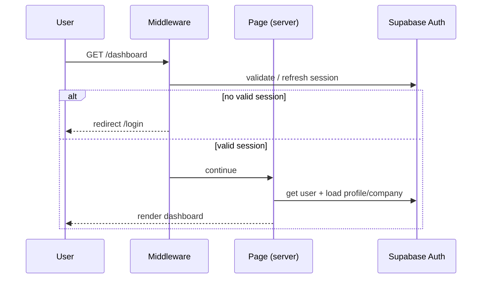

# Authentication

Authentication is handled entirely by **Supabase Auth**. The application never
stores or hashes passwords itself, and credential handling stays out of UI
components.

## Principles

- Supabase Auth owns credentials, sessions, and password reset.
- Auth logic is separated from UI: guards and session helpers live in
  `lib/auth/`, auth UI lives in `components/auth/` and `features/auth/`.
- Every authenticated user maps to exactly one **profile**, and every profile
  belongs to exactly one **company**.
- Protected routes are enforced in **middleware** (server-side), not only in the
  client.
- The browser only ever sees the **anon key**. The **service role key** is
  server-only.

## Identities and the profile link

Supabase Auth manages an `auth.users` record per user. The application keeps a
matching `profiles` row in its own schema:

```
auth.users (managed by Supabase)
   id (uuid)
   email
        |
        | 1:1
        v
profiles (application table)
   id
   auth_user_id  ---> auth.users.id
   company_id    ---> companies.id
   email
   full_name
   role          ---> owner | admin | staff
```

The `profiles` row is the bridge between an authenticated identity and the
company-scoped business data. Loading the current profile (and its company) is
the first thing the dashboard does after a session is confirmed.

## Auth pages

| Route | Purpose | Phase |
|-------|---------|-------|
| `/login` | Email + password sign-in | Phase 1 |
| `/signup` | Invite-ready registration structure | Phase 1 (invite-oriented) |
| `/forgot-password` | Request a password reset email | Phase 1 (if reasonable) |
| `/dashboard` and below | Protected application area | Phase 1+ |

Registration is **invite-oriented**: in an internal tool, users are added to a
company rather than self-registering into arbitrary companies. The `/signup`
structure is built so an invite flow can drive it. Open public self-signup is a
SaaS-phase concern and is not enabled now.

## Session handling

- Sessions are stored in **HTTP-only cookies** managed by the Supabase SSR
  helpers, so server components and middleware can read them.
- **Middleware** runs on protected routes to refresh the session and redirect
  unauthenticated users to `/login`.
- Server components/actions read the session through the **server Supabase
  client**; client components use the **browser client**.
- After login, redirect to `/dashboard`. After logout, clear the session and
  redirect to `/login`.



## Route protection

- **Public:** `/login`, `/signup`, `/forgot-password`, static assets.
- **Protected:** everything under `/dashboard`, `/vehicles`, `/groups`,
  `/publications`, `/history`, `/settings`.
- Middleware is the first gate (redirects unauthenticated users). Server-side
  data access is the second gate (RLS enforces company scope even if a route
  check is missed). This is **defense in depth** — never rely on the client
  alone.

## Roles

Three roles are modeled now; enforcement starts minimal and expands later.

| Role | First-version intent |
|------|----------------------|
| `owner` | Manage company settings, users, vehicles, groups, publications |
| `admin` | Manage vehicles, groups, publications |
| `staff` | Manage assigned operational workflows |

The role lives on the `profiles` row. First-version checks are coarse (is the
user allowed to manage company settings/users?). A finer-grained permission
system is deliberately **not** built yet — the role field is the seam for it.

## States to implement

Every auth surface must handle:

- **Loading** — while a session/profile check is in flight.
- **Error** — invalid credentials, network failures, reset failures, shown as
  user-safe messages (no raw Supabase errors leaked to the UI).
- **Empty / unauthenticated** — clean redirect to `/login`.
- **Success** — clean redirect after login/logout.

## Security rules (summary)

- Do not store passwords manually; Supabase Auth handles credentials.
- Do not expose the service role key or other sensitive env vars to the browser.
- Logged-in users can only access data linked to **their** company (enforced by
  RLS, not just UI).
- Keep auth logic out of UI components.
- See [security-and-rls.md](security-and-rls.md) for the full policy and threat
  model.
