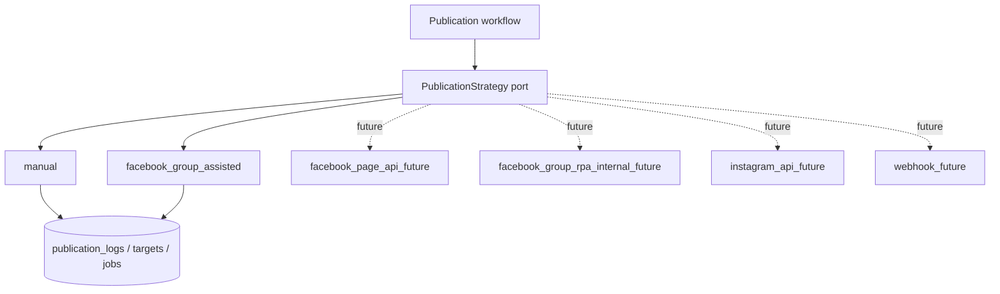

# Automation strategy

Automation is designed as a **ports-and-adapters** boundary that is fully
separated from the UI. The application talks to a `PublicationStrategy`
abstraction; concrete strategies (assisted, future API, future RPA) implement it.
This keeps the core stable and lets new strategies be added without touching the
workflow UI — and without ever building a fragile bot as the foundation.

## Principles

- **Separation:** nothing in `components/` or `features/` imports Playwright or a
  Meta SDK. Automation lives in `automation/` and `integrations/` behind
  interfaces.
- **Honest capabilities:** Facebook Groups are assisted, not auto-posted. Pages
  get official APIs later. The product never claims more than it does.
- **Safety:** no captcha bypass, no anti-detection, no fake user behavior, no
  credential storage, no mass spam posting.
- **Stability gate:** Playwright-based internal RPA is not wired into the main
  workflow until the assisted workflow is stable.

## Strategy abstraction (skeleton, defined in Phase 1)

These are the interfaces the implementation will define. They are described here;
no code is written in Phase 0.

- **`PublicationStrategy`** — given a `Publication` and its targets, executes (or
  assists) publication and returns a `PublicationResult`. Declares its
  `strategy` kind and whether it requires human action.
- **`PublicationJob`** — a unit of execution for a strategy: status, attempts,
  scheduling, timestamps, error. Maps to the `publication_jobs` table.
- **`PublicationTarget`** — a single destination's state and outcome. Maps to the
  `publication_targets` table.
- **`PublicationResult`** — the normalized outcome of a strategy run per target
  (completed / requires_review / failed, with optional `target_url` and error).
- **`PublicationLog`** — structured log entries emitted during a run. Maps to the
  `publication_logs` table.

## Strategies

| Strategy | Status | Description |
|----------|--------|-------------|
| `manual` | Active (v1) | User tracks publication entirely by hand; system records state. |
| `facebook_group_assisted` | Active (v1) | System prepares content + targets; user posts; system tracks results. |
| `facebook_page_api_future` | Reserved | Official Meta Pages API posting. Requires app review + OAuth. |
| `facebook_group_rpa_internal_future` | Reserved | Internal, consent-based, low-volume RPA — only if compliant and stable; never default. |
| `instagram_api_future` | Reserved | Instagram Business API via Meta. |
| `webhook_future` | Reserved | Emit to n8n / Make / external automations. |

## Playwright placement

- Lives only in `automation/playwright/`.
- Not imported by the core workflow in the first version.
- Reserved for **internal** assisted automation and for testing.
- Will only be connected after the assisted workflow is proven stable, and only
  in a way that respects platform terms (no anti-detection, no captcha solving,
  no spam volume).

## Explicitly not built

- Captcha bypass.
- Anti-detection / fingerprint evasion.
- Fake user behavior simulation.
- Facebook password storage.
- Mass spam posting.
- Automatic Facebook Group posting as default core behavior.

## Future integrations (prepared, not implemented)

The `integrations/` layer reserves space for:

- `integrations/meta/` — Meta Pages API, Instagram Business API (OAuth tokens
  stored server-side, encrypted).
- `integrations/webhooks/` — n8n / Make outbound webhooks; WhatsApp
  notifications.

These remain optional and are never the core of the system.
