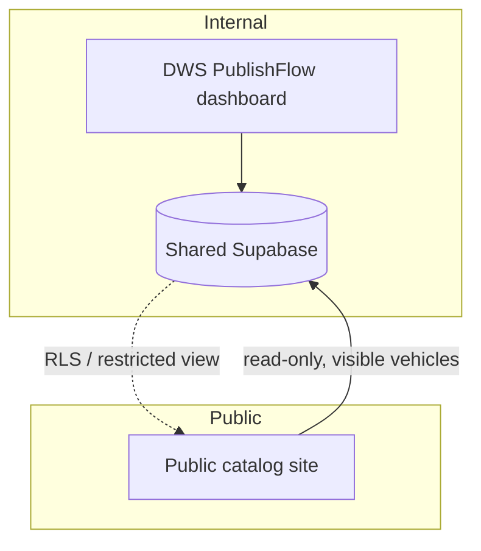

# Public catalog integration (future)

DWS PublishFlow is designed so it can later feed an **existing public vehicle
catalog** — a customer-facing listing — without mixing public access into the
internal dashboard. This is a **future** phase. Nothing here is built in Phase 0,
and no external catalog project is modified.

## Scope now vs later

**Now (Phase 0):** only prepare the internal data model so vehicles can be
exposed later when marked visible. Specifically, the `vehicles.visibility` field:

- `internal_only` — never leaves the dashboard (default).
- `visible_in_catalog` — eligible for the future public catalog.
- `archived` — retired; not shown anywhere public.

**Later (dedicated phase):** connect a public catalog that reads only approved
vehicle data.

## Intended future architecture

- **Shared Supabase database**, with strict access separation.
- The public catalog gets **read-only** access to **only** vehicles where
  `visibility = 'visible_in_catalog'` (and, sensibly, `status = 'published'`),
  plus their images.
- Access is enforced by a dedicated restricted path — for example a Postgres
  **view** or RLS policy that exposes only public-safe columns, queried with a
  separate restricted key. The catalog never uses the dashboard's credentials.

## What must never reach the public catalog

- Internal publication history, targets, and logs.
- Group library data.
- Users, profiles, roles.
- Company settings and private branding/operational data.
- Any vehicle not explicitly `visible_in_catalog`.

Only **public-safe vehicle data** (and approved images) is ever exposed.

## Why keep them separate

- **Security:** the public surface has a minimal, read-only footprint; a
  compromise there cannot reach internal data.
- **Clarity:** the dashboard's RLS assumes authenticated company members; the
  catalog's access assumes anonymous public reads of approved rows. Mixing them
  would weaken both.
- **Independence:** the catalog can evolve (or be replaced) without touching the
  internal tool.

## Preconditions before building this

1. Assisted workflow and inventory management are stable.
2. RLS policies are tested for cross-company isolation.
3. A reviewed public-read contract (view/columns) exists.
4. A separate restricted credential/path is provisioned for the catalog.

Until then, `visibility` is simply recorded so the data is ready when the catalog
phase begins.
