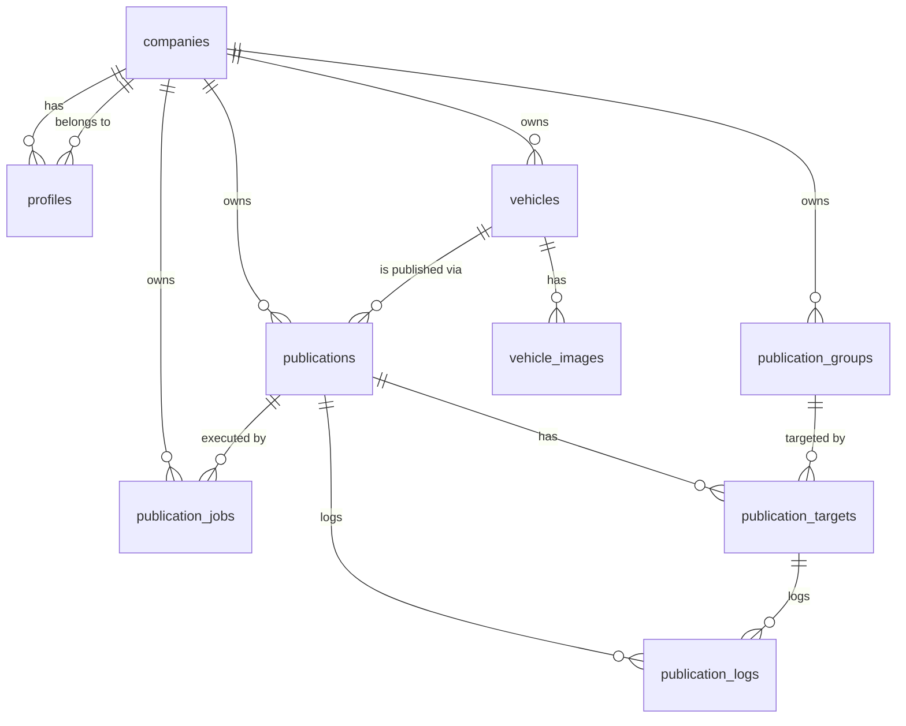

# Database design

The database is **PostgreSQL via Supabase**. It is designed for future
multi-company (SaaS) usage while keeping the first version simple: one company
(Hernández Car Import) exists at launch, but no schema change is needed to add
more.

## Conventions

- Primary keys are `uuid` (default `gen_random_uuid()`).
- Timestamps are `timestamptz`; `created_at` / `updated_at` on mutable tables
  (`updated_at` maintained by a trigger).
- Every company-scoped table carries `company_id` referencing `companies(id)`.
- Status/category fields use Postgres **enums** (or `text` + check constraints)
  for a stable, documented set of values.
- Foreign keys use `on delete` rules chosen per relationship (cascade for owned
  children like images/targets/logs; restrict for references that must not
  orphan).
- Row Level Security is **enabled on every table**. See
  [security-and-rls.md](security-and-rls.md).

## Entity overview

## Enumerated types

| Enum | Values |
|------|--------|
| `user_role` | `owner`, `admin`, `staff` |
| `vehicle_status` | `draft`, `ready`, `published`, `archived` |
| `vehicle_visibility` | `internal_only`, `visible_in_catalog`, `archived` |
| `group_platform` | `facebook_group`, `facebook_page`, `instagram`, `marketplace`, `whatsapp`, `other` |
| `publication_status` | `draft`, `pending`, `processing`, `requires_review`, `completed`, `failed`, `cancelled` |
| `publication_target_status` | `pending`, `requires_review`, `completed`, `failed`, `cancelled` |
| `publication_log_level` | `info`, `warning`, `error`, `success` |
| `publication_strategy` | `manual`, `facebook_group_assisted`, `facebook_page_api_future`, `facebook_group_rpa_internal_future`, `instagram_api_future`, `webhook_future` |
| `publication_job_status` | `pending`, `processing`, `completed`, `failed`, `cancelled` |

## Tables

### companies
Tenant root. Holds branding for the theme system.

| Column | Type | Notes |
|--------|------|-------|
| id | uuid PK | |
| name | text | |
| slug | text unique | URL-safe identifier |
| logo_url | text null | |
| primary_color | text null | brand primary |
| accent_color | text null | brand accent (subtle gold for HCI) |
| theme_key | text | resolves a named theme preset |
| created_at | timestamptz | |
| updated_at | timestamptz | |

### profiles
Bridges a Supabase Auth user to a company and role.

| Column | Type | Notes |
|--------|------|-------|
| id | uuid PK | |
| auth_user_id | uuid unique | references `auth.users(id)` |
| company_id | uuid FK | → companies |
| email | text | |
| full_name | text null | |
| role | user_role | default `staff` |
| created_at | timestamptz | |
| updated_at | timestamptz | |

### vehicles
Core inventory entity.

| Column | Type | Notes |
|--------|------|-------|
| id | uuid PK | |
| company_id | uuid FK | → companies |
| title | text | |
| brand | text | |
| model | text | |
| year | int | |
| price | numeric | |
| mileage | int null | |
| transmission | text null | |
| fuel_type | text null | |
| color | text null | |
| description | text null | |
| status | vehicle_status | default `draft` |
| visibility | vehicle_visibility | default `internal_only` |
| created_by | uuid FK | → profiles |
| created_at | timestamptz | |
| updated_at | timestamptz | |

### vehicle_images
Ordered images for a vehicle, stored in Supabase Storage.

| Column | Type | Notes |
|--------|------|-------|
| id | uuid PK | |
| vehicle_id | uuid FK | → vehicles (on delete cascade) |
| storage_path | text | path in Storage bucket |
| public_url | text null | cached/signed URL |
| sort_order | int | default 0 |
| created_at | timestamptz | |

### publication_groups
Reusable library of publication destinations (the "group library").

| Column | Type | Notes |
|--------|------|-------|
| id | uuid PK | |
| company_id | uuid FK | → companies |
| name | text | |
| url | text | |
| platform | group_platform | default `facebook_group` |
| active | boolean | default true |
| notes | text null | |
| created_at | timestamptz | |
| updated_at | timestamptz | |

### publications
A prepared publication of one vehicle (the content + overall status).

| Column | Type | Notes |
|--------|------|-------|
| id | uuid PK | |
| company_id | uuid FK | → companies |
| vehicle_id | uuid FK | → vehicles |
| status | publication_status | default `draft` |
| publication_text | text | the prepared post text |
| created_by | uuid FK | → profiles |
| created_at | timestamptz | |
| updated_at | timestamptz | |

### publication_targets
Per-destination outcome for a publication (one row per selected group).

| Column | Type | Notes |
|--------|------|-------|
| id | uuid PK | |
| publication_id | uuid FK | → publications (on delete cascade) |
| group_id | uuid FK | → publication_groups |
| status | publication_target_status | default `pending` |
| target_url | text null | link to the resulting post when known |
| published_at | timestamptz null | |
| error_message | text null | |
| created_at | timestamptz | |
| updated_at | timestamptz | |

### publication_logs
Append-only activity log for publications and targets.

| Column | Type | Notes |
|--------|------|-------|
| id | uuid PK | |
| publication_id | uuid FK | → publications (on delete cascade) |
| target_id | uuid FK null | → publication_targets |
| level | publication_log_level | |
| message | text | |
| metadata | jsonb null | structured context |
| created_at | timestamptz | |

### publication_jobs
Execution record for a publication under a given strategy. In the first version
the only active strategies are `manual` and `facebook_group_assisted`; the
`*_future` strategies are reserved. See
[automation-strategy.md](automation-strategy.md).

| Column | Type | Notes |
|--------|------|-------|
| id | uuid PK | |
| company_id | uuid FK | → companies |
| publication_id | uuid FK | → publications |
| strategy | publication_strategy | |
| status | publication_job_status | default `pending` |
| attempts | int | default 0 |
| scheduled_for | timestamptz null | |
| started_at | timestamptz null | |
| completed_at | timestamptz null | |
| failed_at | timestamptz null | |
| error_message | text null | |
| created_at | timestamptz | |
| updated_at | timestamptz | |

## Indexing notes (for the migration phase)

- `company_id` on every scoped table (RLS predicate + common filter).
- `vehicles (company_id, status)` and `vehicles (company_id, visibility)` for
  dashboard counts and list filters.
- `vehicle_images (vehicle_id, sort_order)` for ordered retrieval.
- `publication_targets (publication_id)`, `publication_logs (publication_id)`,
  `publication_jobs (publication_id)`.
- `profiles (auth_user_id)` unique; `companies (slug)` unique.

## What is intentionally deferred

- No billing/subscription tables.
- No cross-company sharing tables.
- No public catalog tables — the catalog reads vehicles filtered by
  `visibility = 'visible_in_catalog'`; see
  [catalog-integration.md](catalog-integration.md).
- Actual SQL migration files are written in **Phase 1**, not Phase 0. The DDL
  here is the design of record those migrations implement.
