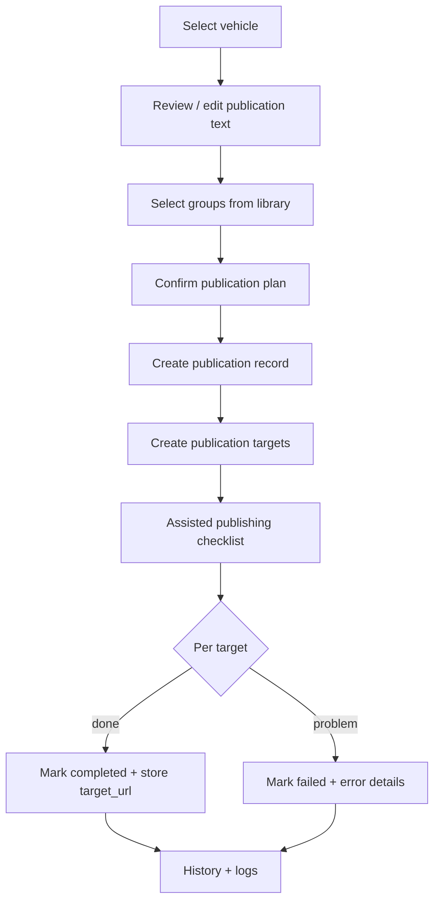

# Publication workflow

The publication workflow turns a vehicle into prepared content and an organized,
trackable set of publication targets. For Facebook Groups it is **assisted**: the
system prepares everything and tracks results, while the user reviews and confirms
the actual post. This makes the tool useful immediately, without pretending to be
a fully automatic bot.

## Why assisted first

- Facebook Groups have no official posting API suited to this use, and automated
  group posting is fragile and against platform norms.
- The reliable, honest value is **preparation and tracking**: content ready to
  paste, targets organized, history recorded.
- Facebook **Pages** do have official APIs; the architecture is prepared to add
  them later as a real automated strategy. See
  [automation-strategy.md](automation-strategy.md).

## Roles of the system vs the user

| The system does | The user does |
|-----------------|---------------|
| Prepare publication text | Review the text |
| Organize selected groups as targets | Confirm/post when manual action is needed |
| Provide copy + open-link actions | Paste and post in the group |
| Record status, history, and logs | Mark each target completed/failed |

## Flow

1. **Select vehicle** — start from a vehicle (typically `ready`).
2. **Review publication text** — edit the prepared text. AI generation is not
   required now; the structure is prepared so AI descriptions can be added later.
   Text is easy to copy and review.
3. **Select groups** — choose destinations from the group library.
4. **Confirm plan** — review vehicle, text, and chosen groups.
5. **Create publication record** — one `publications` row (`status` starts
   `draft`/`pending`).
6. **Create publication targets** — one `publication_targets` row per group,
   `status = pending`.
7. **Assisted publishing checklist** — the working surface (next section).
8. **Track each target** — `pending` → `requires_review` / `completed` /
   `failed` (or `cancelled`).
9. **Store history and logs** — every transition is recorded in
   `publication_logs`.

## Assisted publishing checklist

For each selected Facebook group the checklist shows and offers:

- Group **name** and **URL**.
- The prepared **publication text**.
- The vehicle **images**.
- **Copy text** action.
- **Open group URL** action (new tab).
- **Mark as completed** (optionally capture the resulting post URL).
- **Mark as failed** with an **error/details** field.
- Result stored in **history** with a log entry.

This lets one person move through many groups quickly while keeping an accurate
record of where each vehicle was actually published.

## Status model

**Publication** (`publication_status`): `draft` → `pending` → `processing` →
`requires_review` → `completed` / `failed` / `cancelled`. In the assisted flow,
`processing`/`requires_review` reflect that a human still needs to act; the
overall status can be derived from its targets.

**Target** (`publication_target_status`): `pending` → `requires_review` /
`completed` / `failed` / `cancelled`. The target is the unit of truth for "did
this vehicle get posted to this group."

## Logging

Every meaningful event appends a `publication_logs` row: plan created, target
created, target marked completed/failed, errors. Levels: `info`, `warning`,
`error`, `success`. `metadata` (jsonb) carries structured context (actor, target,
url). This audit trail powers the history module and supports repudiation
defense (see [security-and-rls.md](security-and-rls.md)).

## Relationship to jobs and strategies

A publication can be associated with a `publication_jobs` row describing the
**strategy** used. In the first version the active strategies are:

- `manual` — fully manual tracking.
- `facebook_group_assisted` — the assisted checklist above.

Future strategies (`facebook_page_api_future`, `instagram_api_future`,
`facebook_group_rpa_internal_future`, `webhook_future`) plug in behind the same
abstraction without changing the workflow UI. See
[automation-strategy.md](automation-strategy.md).

## Out of scope now

- Automatic Facebook Group posting as default behavior.
- Scheduling / automatic reposting (modeled via `scheduled_for` on jobs, not
  executed yet).
- AI text generation (structure prepared, not implemented).
