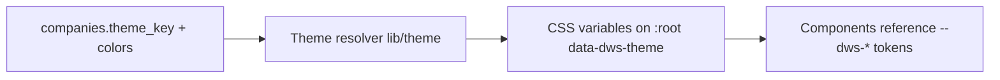

# Theme and branding

The UI is driven by a **centralized, theme-ready design system**. Brand colors
are never hardcoded across components — they live as CSS variables resolved from
a named theme. The first theme is Hernández Car Import; future companies can use
different identities without rewriting the UI.

## Design direction

Automotive, premium, modern, professional — and restrained.

- **Black / near-black** for backgrounds and main UI areas.
- **Red** for primary actions and active states.
- **Subtle gold** for small premium accents only (badges, fine borders, small
  icons, highlights).
- **Neutral grays** for structure, borders, and secondary UI.
- Clean contrast, readable interfaces.

Avoid: overusing red or gold, heavy gradients, excessive animation, marketing
landing-page styling, random icons. This is a serious internal business platform,
not a flashy landing page.

## Theme tokens

Themes are expressed as CSS custom properties. Components reference tokens only —
never raw hex values.

```
--dws-color-background
--dws-color-surface
--dws-color-surface-muted
--dws-color-border
--dws-color-text
--dws-color-text-muted
--dws-color-primary
--dws-color-primary-hover
--dws-color-accent
--dws-color-danger
--dws-color-success
--dws-color-warning
```

### Hernández Car Import theme (initial)

Indicative values, finalized during Phase 1 against contrast checks:

```css
:root[data-dws-theme="hernandez-car-import"] {
  --dws-color-background: #0a0a0b;     /* near-black base */
  --dws-color-surface: #141416;        /* cards, panels */
  --dws-color-surface-muted: #1d1d20;  /* secondary surfaces */
  --dws-color-border: #2a2a2e;         /* neutral gray borders */
  --dws-color-text: #f5f5f6;           /* primary text */
  --dws-color-text-muted: #a1a1aa;     /* secondary text */
  --dws-color-primary: #d11f2a;        /* red, main actions */
  --dws-color-primary-hover: #b51823;  /* red hover/active */
  --dws-color-accent: #c9a227;         /* subtle gold accents */
  --dws-color-danger: #dc2626;
  --dws-color-success: #16a34a;
  --dws-color-warning: #d97706;
}
```

Gold (`--dws-color-accent`) is reserved for small premium details. It is not a
general-purpose action color.

## How theming works

1. **Tailwind reads the tokens.** Tailwind's theme maps semantic color names to
   the CSS variables, so utilities like `bg-[var(--dws-color-surface)]` (or
   mapped semantic names) stay theme-driven. Token definitions and the resolver
   live in `lib/theme/`.
2. **A theme is selected per company.** The `companies` row carries `theme_key`
   (plus optional `primary_color` / `accent_color` overrides). The app sets a
   `data-dws-theme` attribute on the document root from the active company.
3. **Runtime resolution.** On load, the active company's theme is applied. No
   component imports brand colors directly; switching themes is a data change,
   not a code change.



## Multi-company theming (prepared)

Future companies can differ by:

- Different `primary_color` / `accent_color`.
- Different `theme_key` preset.
- Different `logo_url`.
- Different company name and dashboard branding.

Because every component reads tokens, a new company means a new theme entry plus
its branding row — not a UI rewrite. Per-company overrides from the `companies`
row can layer on top of the named preset.

## Rules

- Never hardcode brand hex values in components.
- Never tie the whole UI permanently to Hernández Car Import.
- All component classes follow the BEM `dws-` convention (see
  [code-standards.md](code-standards.md)).
- Keep all theme logic centralized in `lib/theme/`.
- Verify contrast (WCAG AA where reasonable) when finalizing token values.
